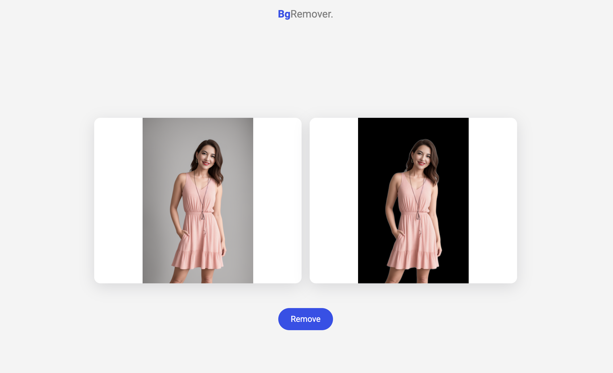

### 🌌 BgRemover

An image background remover application made with Python/Flask as a backend and HTML/JS/CSS as frontend. It's a full responsive website, designed with mobile first methodology.

The `API` endpoint is accessible in the `/removebg` path, which can be used as follows:

```js
const body = {
    image: "some-image-on-base64-format",
};
try {
    const response = await axios.post("/removebg", body);
    const result = response?.data?.result;
} catch (error) {
    console.error(error);
}
```

### ⚙️ Technologies

-   Flask
-   Pillow
-   Rembg
-   HTML/CSS/JS
-   Alpine.js

### 📦 Installation

```

pip install -r requirements.txt

```

### ⚡️ Development

```

flask --app main run --debug

```
